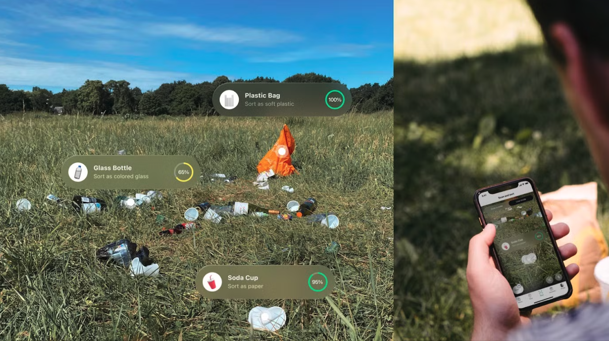
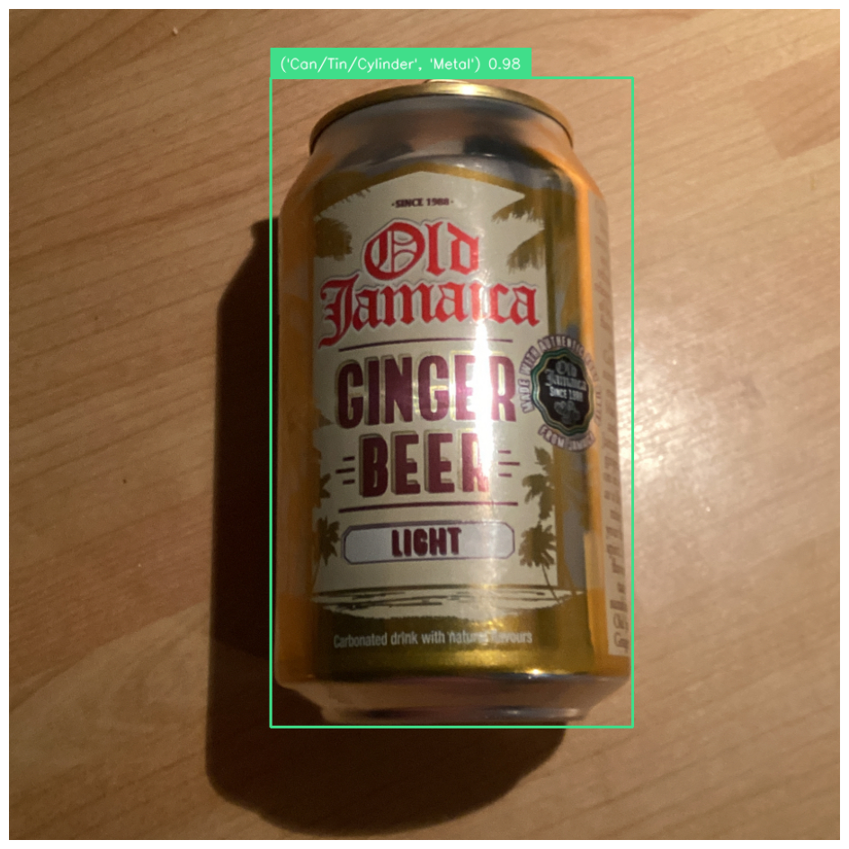
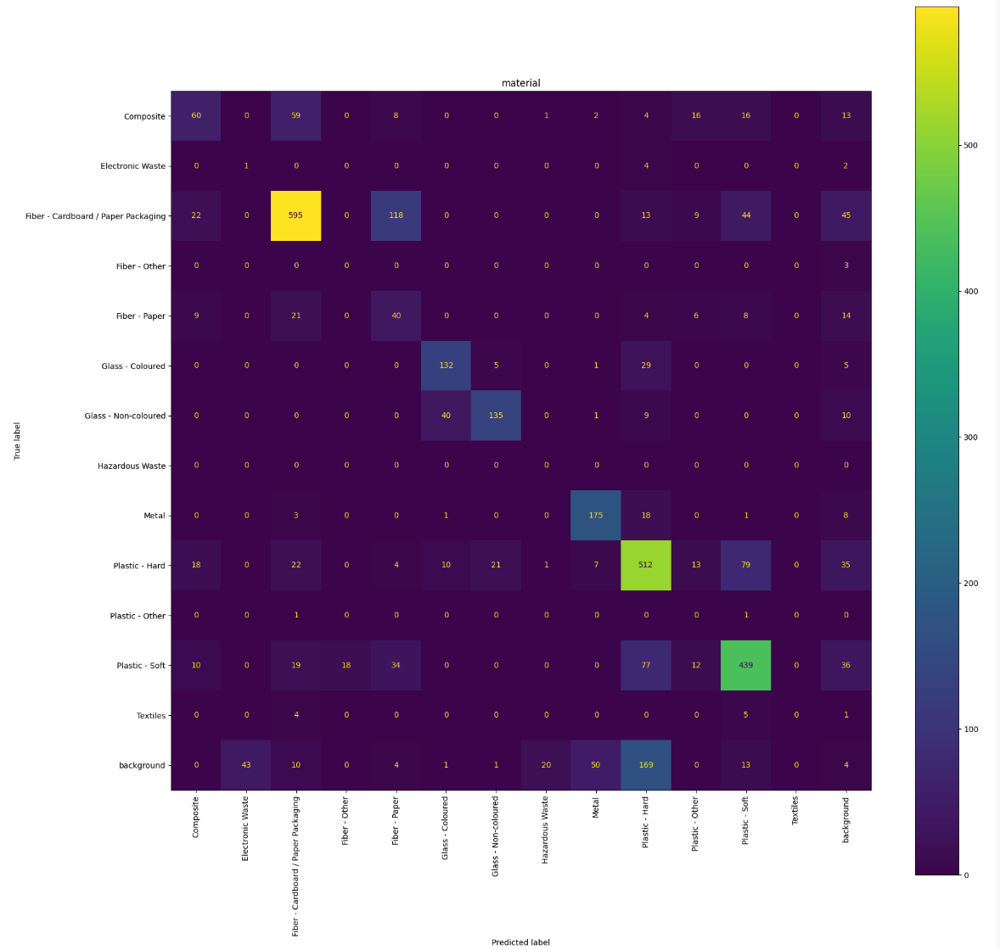
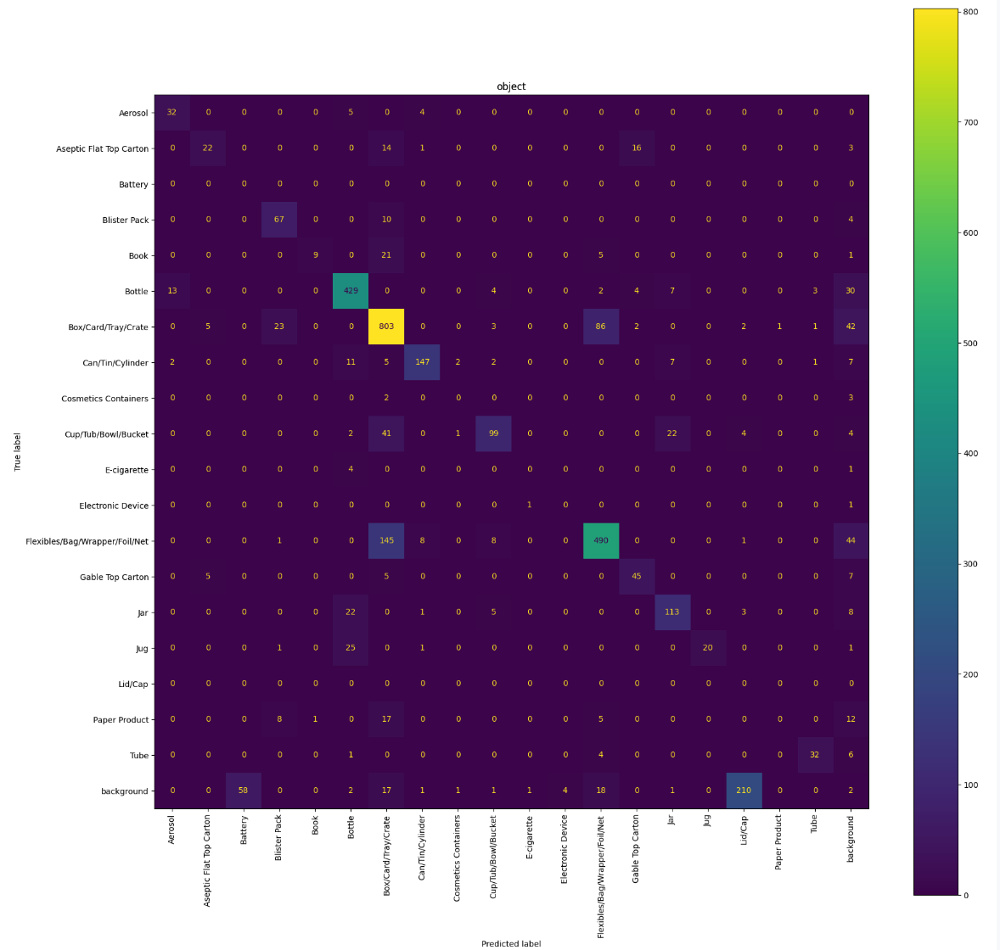

# **Seegull**  
**Seegull is the library that powers [Bower's](https://getbower.com/) barcodeless scanning functionality. It includes tools for training object detection models, pretrained models, and datasets.**
<div align="center">
  
    
            The model,data and code offered by Bower (Sugi Group AB) in collaboration with Google.org 
</div>


---

## **Installation**

### Prerequisites
Before installing, ensure the following system dependencies are installed:
- `libgl1`
- `libusb-1.0-0-dev`


🚧 **TODO: Publish Seegull to PyPI.**

Once published, you can install Seegull via pip:  
```bash
pip install seegull
```

Untill it has beens published to PyPI we recommend installing like following:

In your instance, fork the repository, then run:

```bash
cd seegull/
sudo apt-get update
sudo apt-get install -y --no-install-recommends libgl1 libusb-1.0-0-dev
python -m pip install --upgrade pip
python -m pip install -e .[dev]
yolo export model=yolov8n.pt format=saved_model # Install YOLO export dependencies
```

if you do local modifications to the code remember to run
```bash
pip install .
```
for the modifications to be applied.


---

## **Usage**

**You can use one of the pretrained models to detect objects and predict their object and material types.**


**Example code snipplet from [YOLOMultiLabel.ipynb](notebooks/YOLOMultiLabel.ipynb)**:
```python
import pandas as pd
from huggingface_hub import hf_hub_download
from datasets import load_dataset_builder, load_dataset

from seegull import Image, get_image_df, load_image
from seegull import YOLOMultiLabel


# Load the pretrained model
model_path = hf_hub_download(repo_id="BowerApp/bowie-yolov8-multihead-trash-detection", filename="yolov8m_object_material_best.pt")
model = YOLOMultiLabel(model_path)

# Loading eval data set from huggingface
ds_builder = load_dataset_builder("BowerApp/bower-waste-annotations")
display(ds_builder.info.features)
dataset = load_dataset("BowerApp/bower-waste-annotations", split="train")
df = pd.DataFrame( dataset )
df = get_image_df(df, pre_loaded_images=True )
df

# Load an image and make predictions

image = Image(url="...")
image.predict(model).annotate().display()
```

The code above will generate a visual annotation of the detected object and its predicted properties.  

Example output:  


For more comprehensive examples, check out the [notebooks](notebooks/) folder.

---

## **[Model](https://huggingface.co/BowerApp/bowie-yolov8-multihead-trash-detection)**

**Latest trained multi-detection model available on [Huggingface](https://huggingface.co/BowerApp/bowie-yolov8-multihead-trash-detection).**


### Key Features

1. **YOLO Model Wrapper**:
   - `YOLO`: A class that wraps around the `ultralytics.YOLO` model, adding features such as validation, predictions, and exporting TensorFlow models with custom signatures.
   - `YOLOMultiLabel`: An extended version of `YOLO` for multi-label object detection using a modified YOLO model (see [ultralytics_bower](https://github.com/PantaPasen/ultralytics)).
2. **Custom TensorFlow Signature Export**:
   - Allows exporting a YOLO model in TensorFlow SavedModel format.
   - Adds preprocessing and postprocessing steps for model inference.
   - Optionally integrates DINOv2 embeddings for detected objects.
3. **Model Validation**:
   - The `YOLOValidation` class provides tools for validating YOLO models.
   - Supports metrics such as precision, recall, and F1-score.
   - Visualizes discrepancies between predictions and ground truth.
4. **Dataset Preparation**:
   - Converts labeled datasets into YOLO-compatible training data format.
   - Supports both single-label and multi-label training data.
   - Automatically creates `train` and `test` splits with associated image and label files.
5. **Enhanced Predictions**:
   - Generates predictions with additional details, such as confidence scores, bounding boxes, and multi-label classifications.
   - Implements filtering and postprocessing for more accurate detections.

**Confusion matrix for predicting material and object on the [evaluation dataset](https://huggingface.co/datasets/BowerApp/bower-waste-annotations)**

<div align="center">
  
  
    
            The data offered by Bower (Sugi Group AB) in collaboration with Google.org 
</div>

---

## **[Dataset](https://huggingface.co/datasets/BowerApp/bower-waste-annotations)**

**Our validation dataset ([bower-waste-annotations](https://huggingface.co/datasets/BowerApp/bower-waste-annotations)) have been uploaded on hugggingface.** 


**The bower-waste-annotations dataset consists of 1440 images of waste and various consumer items taken by consumer phone cameras. The images are annotated with Material type and Object type classes, listed below.
The images and annotations has been manually reviewed to ensure correctness. It is assumed to have high quality of both bounding box accuracy and material + object combination. The purpose of the dataset has been to validate models - therefor all images in this set is categorized as validation data. As quality of annotations is high, one can use this as ground truth for validating models.
This data set was created in a collaboration with Google.org and Google employees as part of the [Google Impact Challenge: Tech for social good](https://impactchallenge.withgoogle.com/techforsocialgood/) support that Bower got H1 2024. Which had as goal to create impact in the area of sustainability and waste. Any use of this data that contributes to this purpose is highly appreciated! Let us know how you contribute.**


### Data Contributors

Lucas Nilsson, Linda Attby, Louise Rönne, Henrik Erskérs, Jeremy Neiman, Suhani


### Contributions

Thanks to Google.org for making this possible, as well as the Google Fellows joining Bower for 6 months to enable this (Jeremy, Vicent, Suhani, Vivek, Ole and Rita).


---
## Additional Information

### Contributors

Lucas Nilsson, Linda Attby, Louise Rönne, Henrik Erskérs, Jeremy Neiman, Suhani

### **Contributing**

Contributions are welcome! If you have improvements, bug fixes, or new ideas, feel free to open a pull request.

---

